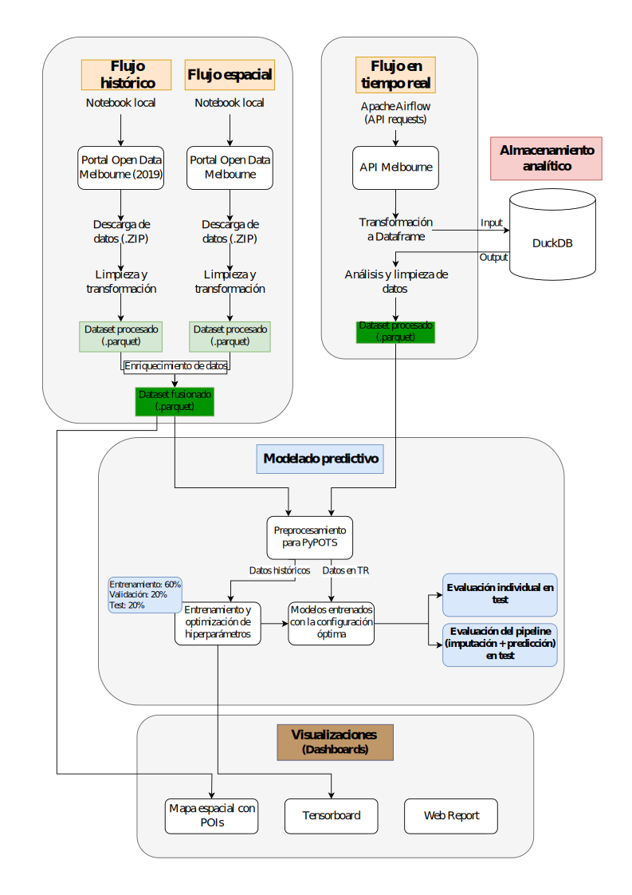

# Análisis mediante Redes de Aprendizaje Profundo de Series Temporales Parcialmente Observadas sobre Datos de Ocupación de Estacionamiento en un Espacio Urbano Inteligente

Este portal web documenta los descubrimientos y resultados más relevantes del trabajo de fin de grado realizado por Pablo Pardo Gutiérrez.

> TIP: puede utilizar el menú superior para explorar las diferentes secciones del proyecto.

## Sobre el proyecto

La transición hacia las ciudades inteligentes requiere la implementación de ecosistemas digitales capaces de monitorizar y optimizar la infraestructura urbana. En el ámbito de la movilidad, el tráfico originado por vehículos en búsqueda de estacionamiento constituye una de las principales fuentes de congestión y emisiones. Si bien se ha desplegado una red de sensores IoT para monitorizar la demanda de aparcamiento, la volatilidad física de estos dispositivos genera series temporales discontinuas y plagadas de valores faltantes, lo cual limita el análisis de datos y la toma de decisiones.

El presente trabajo fin de grado tiene como objetivo principal el diseño e implementación de una arquitectura predictiva integral para solucionar este desafío. Se propone un sistema *end-to-end* capaz de ingerir y almacenar telemetría IoT ininterrumpida, para posteriormente aplicar modelos de aprendizaje profundo enfocados a la reconstrucción de los fallos de red y a la predicción de la futura demanda de ocupación de las plazas de estacionamiento.

Para hacer esto posible, el entrenamiento y la optimización paramétrica de los diferentes modelos se ha llevado a cabo mediante el procesamiento de un gran conjunto de datos históricos. Se hace uso de la librería especializada PyPOTS para la carga de diversas arquitecturas entre las que se encuentran mecanismos de auto-atención, modelos de difusión probabilística, lineales y convolucionales, tanto para la imputación de datos faltantes como para la predicción de ocupación futura. Por otro lado, para la fase de evaluación en producción, se ha desarrollado una infraestructura orquestada mediante Apache Airflow y Docker que extrae información en tiempo real de la API de la ciudad de Melbourne (Australia) y la almacena en la base de datos analítica DuckDB. De forma complementaria, el flujo predictivo se ha enriquecido con un mapa cartográfico de clasificación espacial de los sensores en función de puntos de interés cercanos. 

De esta forma, la investigación desarrollada valida metodológicamente la aplicación de arquitecturas del estado del arte en entornos de producción sujetos a la evolución constante del tráfico, con el objetivo de consolidar un marco tecnológico resiliente para la gestión de la movilidad basada en datos.

### Arquitectura del sistema

Para garantizar la escalabilidad y robustez del sistema, se ha diseñado una arquitectura orientada a los datos, dividida en cuatro fases secuenciales que abarcan desde la ingesta hasta la visualización final:

* **Flujo histórico y espacial.** Ejecutados localmente mediante *notebooks* de Python: extraen datos estáticos del portal de datoa abiertos de Melbourne. Tras varias etapas de procesamiento, se cruza información temporal y geográfica para generar un dataset unificado adecuado al entrenamiento de las redes neuronales.
* **Flujo en tiempo real.** Orquestado íntegramente por Apache Airflow: interactúa recurrentemente con la API disponibilizada para obtener telemetría en tiempo real. La información consumida se almacena en la base de datos DuckDB, con el objetivo de evaluar los modelos entrenados en un entorno de producción.
* **Modelado predictivo.** Núcleo analítico apoyado en la librería PyPOTS: abarca la optimización de hiperparámetros durante el entrenamiento y la evaluación final. Se distingue entre el rendimiento de modelos individuales y la combinación de los mismos (imputación + predicción).
* **Visualizaciones.** Ecosistema de divulgación visual: incluye un mapa espacial interactivo, la monitorización de telemetría de entrenamiento en TensorBoard y el presente portal web ilustrativo.

{fig-align="center"}