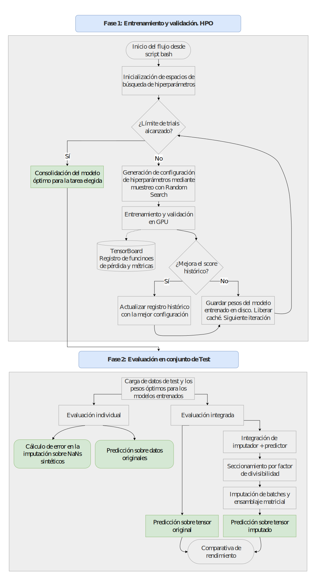
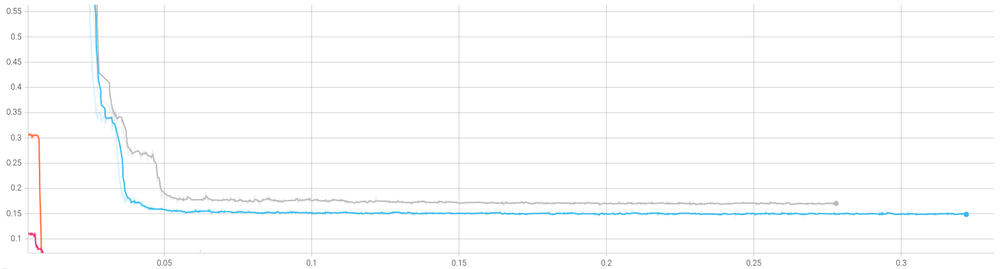

El núcleo predictivo del proyecto se fundamenta en la comparativa empírica de distintas arquitecturas de deep learning para resolver dos problemas asociados a las series temporales: la imputación de valores nulos y la predicción de los valores futuros.

Para abordar ambos retos, el sistema integra modelos representativos de los principales paradigmas actuales. En las tareas de **imputación**, se evalúan arquitecturas como SAITS, basada en autoatención, 
y CSDI, un modelo generativo de difusión probabilística. Por otro lado, para las tareas de **predicción**, se comparan tres paradigmas diametralmente opuestos: la arquitectura Transformer como el mecanismo de atención puro, MICN, con su extracción de características 
mediante convoluciones isométricas, y DLinear, donde se aplica una descomposición matemática lineal.

## Metodología y orquestación del flujo de trabajo

Para aislar la complejidad matemática y maximizar el uso de los recursos computacionales de forma desatendida, el proceso de entrenamiento se automatiza completamente. Se emplean *scripts* de *Bash* que inicializan el entorno y ejecutan secuencialmente el *pipeline* de optimización.

El ciclo de vida algorítmico sigue el siguiente esquema lógico:

{fig-align="center"}

### 1. Optimización de Hiperparámetros (HPO)
La búsqueda paramétrica se gestiona en cuatro etapas:

* **Inicialización.** Carga de los espacios de búsqueda dinámica.
* **Generación de hiperparámetros.** Creación de configuraciones paramétricas únicas mediante muestreo probabilístico (*Random Search*).
* **Entrenamiento y validación.** Entrenamiento de la red neuronal y validación de su capacidad de generalización. Se integra telemetría directa hacia TensorBoard para registrar las curvas de pérdida.
* **Actualización:** Comparativa del error resultante con el mejor registro histórico. Almacenamiento de los pesos del modelo entrenado.

### 2. Evaluación en el conjunto de prueba
Finalizada la optimización, se evalúan las arquitecturas con la mejor configuración bajo tres enfoques:

* **Evaluación individual.** Se calcula el error del modelo sobre el conjunto de *test*.
* **Evaluación integrada.** Se calcula el error de la combinación secuencial de un modelo de imputación junto a otro modelo de predicción.
* **Evaluación *Out-Of-Time*.** Se realiza una prueba de estrés sobre los datos consumidos en tiempo real para observar el error obtenido por las distintas implementaciones ya entrenadas. Busca evaluar la resistencia a la deriva conceptual.

## Convergencia de los modelos

En la telemetría extraída durante el entrenamiento, las funciones de pérdida arrojan información valiosa sobre cómo los diferentes modelos se adaptan a los datos. 
Se observa un desplome rápido del error en las convoluciones de MICN frente a un estancamiento prolongado de la red Transformer, incapaz de mejorar a lo largo de las iteraciones.

{fig-align="center"}

## 1. Resultados en tareas de imputación

Se contrastan heurísticas clásicas de la industria (media global y LOCF) frente a las arquitecturas de imputación:

| Modelo / Algoritmo | MAE | MSE | RMSE |
|:---|:---:|:---:|:---:|
| **SAITS** | **0.05555** | **0.01189** | **0.10902** |
| Media Global | 0.37965 | 0.26472 | 0.51451 |
| LOCF | 0.53709 | 61.99049 | 7.87340 |
| CSDI | 3.83389 | 100.37682 | 10.01882 |

: Métricas de evaluación en el conjunto de test histórico para tareas de imputación. {tbl-colwidths="[40, 20, 20, 20]"}

**Conclusiones clave:**

* **Superioridad determinista.** La arquitectura SAITS domina la comparativa de forma absoluta. En el conjunto de datos de producción, el modelo incluso mejora su rendimiento (MAE de 0.039), lo que demuestra que ha logrado interiorizar el comportamiento subyacente de los usuarios.
* **Colapso de la inercia.** El algoritmo clásico LOCF fracasa rotundamente ante la alta volatilidad de los cambios de estado binarios en el estacionamiento urbano.

## 2. Resultados en tareas de predicción

Se evalua la capacidad de proyección futura y se obtienen los siguientes resultados:

### Horizonte a 24 horas

| Modelo | MAE | MSE | RMSE |
|:---|:---:|:---:|:---:|
| **MICN** | **0.03848** | 0.02181 | 0.14768 |
| **DLinear** | 0.06503 | **0.02013** | **0.14188** |
| Transformer | 0.26443 | 0.15471 | 0.39334 |

: Resultados de la predicción a 24 horas. {tbl-colwidths="[40, 20, 20, 20]"}

### Horizonte a 48 horas

| Modelo | MAE | MSE | RMSE |
|:---|:---:|:---:|:---:|
| **MICN** | **0.04639** | 0.02492 | 0.15787 |
| **DLinear** | 0.07342 | **0.02136** | **0.14615** |
| Transformer | 0.30828 | 0.17860 | 0.42261 |

: Resultados de la predicción a 48 horas. {tbl-colwidths="[40, 20, 20, 20]"}

**Conclusiones clave:**

* **Fracaso del método de atención puro.** Los resultados confirman empíricamente que la arquitectura Transformer resulta subóptima para estas series temporales.
* **Similitud de rendimiento para MICN y DLinear.** Las métricas obtenidas son similares, aunque la convolución isométrica captura la volatilidad diaria y obtiene el menor MAE. Por su parte, la descomposición lineal asume un comportamiento más conservador y evita predecir anomalías extremas. Gracias a ello, minimiza el error cuadrático (MSE).
* **Resiliencia de DLinear en producción.** Al someter los modelos a datos obtenidos en tiempo real, DLinear ha demostrado una robustez estructural excepcional al horizonte de 48 horas. Por el contrario, MICN ha presentado una degradación de rendimiento debido a la imposibilidad técnica de escalar su ventana de contexto histórico.

## 3. Evaluación de la integración de modelos consecutivamente

Se realiza un ensayo empírico para cuantificar si sanear la señal con un modelo de imputación antes de predecir a futuro justifica su altísimo coste computacional frente a predecir con la señal original.

Para garantizar la rigurosidad del análisis, se seleccionaron cuatro escenarios de prueba estratégicos. En la siguiente tabla se consolidan los resultados de someter el conjunto de prueba a las redes de predicción de forma aislada (datos crudos) y, posteriormente, a través del *pipeline* de preprocesamiento (datos imputados por SAITS):

| Pipeline (Imputador → Predictor) | Estado | MAE | MSE | Var. (%) |
|:---|:---|:---:|:---:|:---:|
| **SAITS → MICN (24H)** | Crudo | 0.03845 | 0.02177 | -0.05% |
| | Imputado | **0.03843** | **0.02165** | |
| **SAITS → DLinear (24H)** | Crudo | 0.06503 | 0.02010 | -0.49% |
| | Imputado | **0.06471** | **0.02006** | |
| **SAITS → DLinear (48H)** | Crudo | **0.07342** | **0.02136** | +0.49% |
| | Imputado | 0.07378 | 0.02136 | |
| **SAITS → Transformer (24H)** | Crudo | 0.26451 | 0.15475 | -0.04% |
| | Imputado | **0.26440** | **0.15473** | |

: Resultados del *pipeline* integrado. Comparativa de error MAE sobre datos originales frente a datos previamente imputados por SAITS. {tbl-colwidths="[35, 15, 20, 20, 10]"}

Tras analizar las variaciones de rendimiento, se extraen tres conclusiones fundamentales:

* **El SoTA es robusto por naturaleza.** Inyectar la señal perfectamente imputada genera una mejora virtualmente inexistente en ambos horizontes temporales. Las arquitecturas predictivas modernas asimilan los vacíos y anomalías de los sensores con tal eficacia que anulan la necesidad de aplicar técnicas generativas de imputación previas.
* **Propagación del error por escalabilidad.** En escenarios de medio-largo plazo, la imputación en cascada puede degradar ligeramente el rendimiento (véase el +0.49% de error obtenido). Las pequeñas imprecisiones de imputación se acumulan a lo largo de ventanas temporales extensas, lo cual afeca negativamente a la capa predictiva.
* **Refutación algorítmica del Transformer.** Se comprueba que mal rendimiento de la arqutiectura basada en atención se debe a una cuestión estructural y no a una simple intolerancia de valores ausentes: al inyectarle la señal totalmente reconstruida la mejora es estadísticamente nula.
