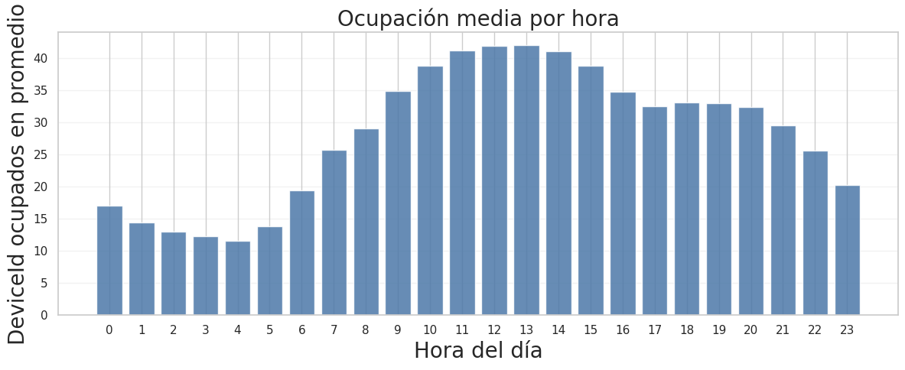
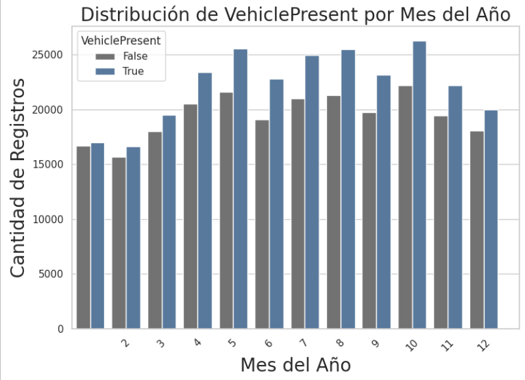

El tratamiento del dato urbano requiere comprender las dinámicas temporales del tráfico y la topología espacial de la ciudad. A continuación, se presentan los hallazgos principales de la fase exploratoria.

## Dinámica Temporal del Estacionamiento

El análisis masivo del histórico de Melbourne revela estacionalidades fuertemente marcadas por el ciclo laboral y comercial de la ciudad. A continuación se expone la distribución temporal cruzada con la variable objetivo (presencia de vehículo).

### Rotación diaria
El volumen de eventos de aparcamiento muestra una dependencia total del horario laboral, con un valle de inactividad de madrugada y picos máximos en las horas centrales del día.

{fig-align="center"}

### Estacionalidad anual
La validación temporal de la muestra extraída confirma que no existen sesgos cronológicos, capturando de forma homogénea todas las épocas del año.

{fig-align="center" width="80%"}
## Hotspots de Aparcamiento

La demanda de estacionamiento no se distribuye de manera uniforme, sino que se concentra en vías principales correspondientes a distritos financieros o áreas de alta concentración de servicios.

{fig-align="center" width="80%"}

## Clasificación Espacial e Integración Cartográfica

Para dotar al sistema de contexto geoespacial, se ha cruzado el inventario de sensores con la API de OpenStreetMap, clasificando cada plaza según la densidad de Puntos de Interés (POIs) cercanos en un radio de 100 metros (Comercial, Residencial, CBD o General).

A continuación se presenta el renderizado interactivo de la red de sensores. **Puedes interactuar con el mapa, hacer zoom y pasar el cursor sobre los sensores** para ver su identificador, vía y clasificación asignada:

```{=html}
<iframe src="maps/map_locations.html" width="100%" height="600px" style="border: 2px solid #ccc; border-radius: 8px;"></iframe>
```